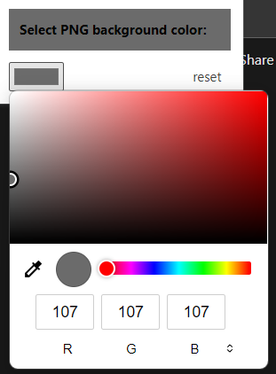

# Notion Dark Mode PNG Background Color

Add Background Color to enhance the visibility of the letters in the PNG image
because dark letters in the transparent PNG image in Notion dark mode is nearly invisible. 

Text is invisible like This!

> source: [wikipedia](https://en.wikipedia.org/wiki/Hash_table)

So, I made this extension to add "background-color" in the transparent PNG with color picker.

Result is

